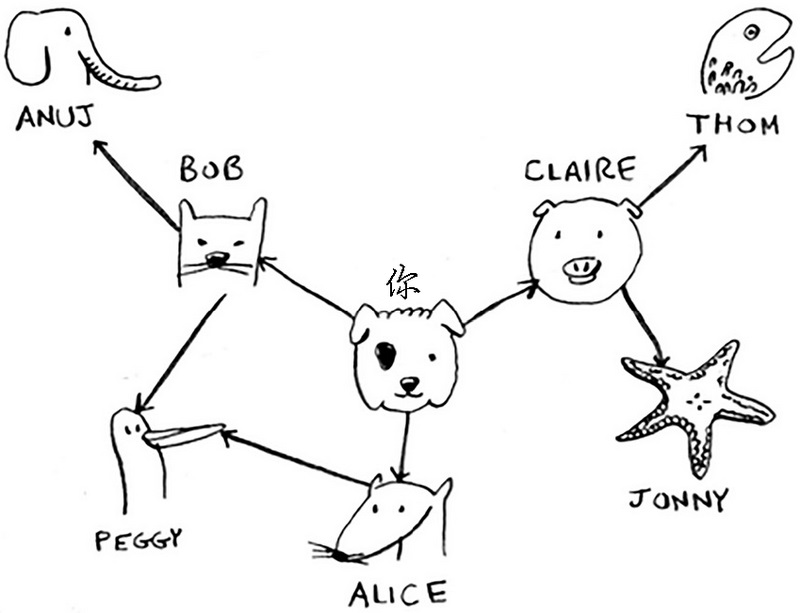

本文主要介绍go语言实现广度优先搜索算法，借助该算法从下图中寻找出一个芒果销售商（名字以字母`m`结尾）：



算法实现如下：

```go
package main

import "fmt"

func main() {
    graph := createGraph()
    breadthFirstSearch(graph, "you")
}

func personIsSeller(name string) bool {
    return name[len(name)-1] == 'm'
}

func createGraph() map[string][]string {
    graph := make(map[string][]string)
    graph["you"] = []string{"alice", "bob", "claire"}
    graph["bob"] = []string{"anuj", "peggy"}
    graph["alice"] = []string{"peggy"}
    graph["claire"] = []string{"thom", "jonny"}
    graph["anuj"] = []string{}
    graph["peggy"] = []string{}
    graph["thom"] = []string{}
    graph["jonny"] = []string{}
    return graph
}

func breadthFirstSearch(graph map[string][]string, name string) bool {

    searchList := graph[name]
    if len(searchList) == 0 {
        return false
    }

    searched := make(map[string]bool)
    for {
        person := searchList[0]
        searchList = searchList[1:]
        _, found := searched[person]
        if !found {
            if personIsSeller(person) {
                fmt.Println(person + " is a mango seller!")
                return true
            } else {
                searchList = append(searchList, graph[person]...)
                searched[person] = true
            }
        }

        if len(searchList) == 0 {
            break
        }
    }

    return false
}
```

## 参考：《算法图解》