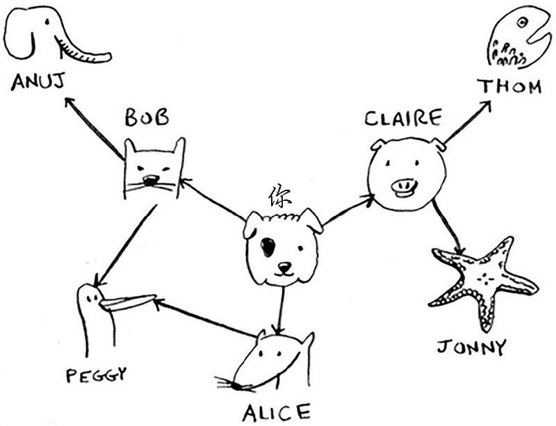

广度优先搜索算法（Breadth First Search，缩写为BFS），又译作宽度优先搜索，或横向优先搜索，是一种图形搜索算法。简单的说，广度优先搜索算法是从根节点开始，沿着树的宽度遍历树的节点。如果所有节点均被访问，则算法中止。借助广度优先搜索算法，可以让你找出两样东西之间的最短距离。

本文通过go语言实现广度优先搜索算法，使用该算法从朋友圈中找出关系最近的售货员。

下面介绍详细的实现过程，首先，调用createFriendCircle函数创建一个模拟的朋友圈，朋友圈如下图所示：



朋友圈通过字典实现，字典的键是朋友圈属主，值是朋友圈所有朋友名字，通过一个列表方式实现，名字按字母顺序排序。

其次，传递创建的朋友圈给breadthFirstSearch函数，该函数是广度优先搜索算法的具体实现，在函数内部，首先取出you的所有朋友，如果朋友数为0，查找失败，返回false。如果朋友数不为0，则从you的所有朋友中取出一个朋友，并将朋友从待查找的朋友中删除，然后创建一个字典记录被查找过的朋友，避免再次查找。如果该朋友没有被检查过，则检查该朋友是否是售货员（名字以字母`y`结尾）。如果是售货员，查找成功，返回true。如果该朋友不是售货员，将该朋友的所有朋友又添加到待查找朋友列表中，继续查找，直到结束，实现一种类似`Z`字形的搜索路径。

由示例中可以看到，查找到的售货员是peggy，而不是jonny。因为这里的朋友名字是按字母顺序排序，所以优先查找了bob的朋友，而不是claire的朋友，即peggy是朋友圈中距离you最近的售货员朋友。

示例代码如下：

```go
package main

import "fmt"

func main() {
    friendCircle := createFriendCircle()
    breadthFirstSearch(friendCircle)
}

func personIsSeller(name string) bool {
    return name[len(name)-1] == 'y'
}

func createFriendCircle() map[string][]string {
    fc := make(map[string][]string)
    fc["you"] = []string{"alice", "bob", "claire"}
    fc["bob"] = []string{"anuj", "peggy"}
    fc["alice"] = []string{"peggy"}
    fc["claire"] = []string{"thom", "jonny"}
    fc["anuj"] = []string{}
    fc["peggy"] = []string{}
    fc["thom"] = []string{}
    fc["jonny"] = []string{}
    return fc
}

func breadthFirstSearch(friendCircle map[string][]string) bool {
    searchList := friendCircle["you"]
    if len(searchList) == 0 {
        return false
    }

    searched := make(map[string]bool)
    for {
        person := searchList[0]
        searchList = searchList[1:]
        _, found := searched[person]
        if !found {
            if personIsSeller(person) {
                fmt.Println(person + " is a seller!")
                return true
            } else {
                searchList = append(searchList, friendCircle[person]...)
                searched[person] = true
            }
        }

        if len(searchList) == 0 {
            break
        }
    }

    return false
}

/*
peggy is a seller!
*/

```

## 参考：

- 《算法图解》
- https://zh.wikipedia.org/wiki/%E5%B9%BF%E5%BA%A6%E4%BC%98%E5%85%88%E6%90%9C%E7%B4%A2